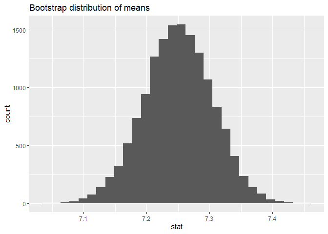
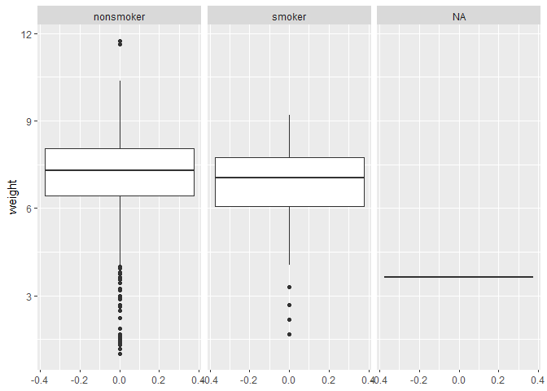

Lab 11 - Smoking during pregnancy
================
Eric Stone
4.11.24

### Load packages and data

``` r
library(tidyverse) 
library(tidymodels)
```

    ## Warning: package 'tidymodels' was built under R version 4.3.3

    ## Warning: package 'dials' was built under R version 4.3.3

    ## Warning: package 'infer' was built under R version 4.3.3

    ## Warning: package 'modeldata' was built under R version 4.3.3

    ## Warning: package 'parsnip' was built under R version 4.3.3

    ## Warning: package 'recipes' was built under R version 4.3.3

    ## Warning: package 'rsample' was built under R version 4.3.3

    ## Warning: package 'tune' was built under R version 4.3.3

    ## Warning: package 'workflows' was built under R version 4.3.3

    ## Warning: package 'workflowsets' was built under R version 4.3.3

    ## Warning: package 'yardstick' was built under R version 4.3.3

``` r
library(infer)
library(openintro)
```

    ## Warning: package 'openintro' was built under R version 4.3.3

    ## Warning: package 'airports' was built under R version 4.3.3

    ## Warning: package 'cherryblossom' was built under R version 4.3.3

    ## Warning: package 'usdata' was built under R version 4.3.3

### Setting seed

``` r
set.seed(23423432)
```

### Loading data

``` r
data(ncbirths)
```

### Exercise 1

> What are the cases in this data set? How many cases are there in our
> sample?

``` r
number_of_rows <- nrow(ncbirths)
```

The cases are mothers.

There are 1000 cases.

### Exercise 2

> Create a filtered data frame called ncbirths_white that contains data
> only from White mothers. Then, calculate the mean of the weights of
> their babies.

``` r
ncbirths_white <- ncbirths %>%
  filter(whitemom == "white")
```

``` r
ncbirths_white %>%
  summarize(mean(weight),sd(weight))
```

    ## # A tibble: 1 × 2
    ##   `mean(weight)` `sd(weight)`
    ##            <dbl>        <dbl>
    ## 1           7.25         1.43

So the sample mean is 7.25. Which is less than 7.43.

### Exercise 3

> Are the criteria necessary for conducting simulation-based inference
> satisfied? Explain your reasoning.

Why wouldn’t it be? I might be missing something, but isn’t the idea
that there aren’t really assumptions for using bootstrapping, because
that procedure essentially just estimates the standard error? We want to
figure out whether the distribution of sample bootstrapped means
includes 7.43. This seems fine to me.

``` r
boot_df <- ncbirths_white %>%
  specify(response = weight) %>% 
  generate(reps = 15000, type = "bootstrap") %>% 
  calculate(stat = "mean")
ggplot(data = boot_df, mapping = aes(x = stat)) +
  geom_histogram() +
  labs(title = "Bootstrap distribution of means")
```

<!-- -->

``` r
boot_df %>%
  summarize(lower = quantile(stat, 0.025),
            upper = quantile(stat, 0.975))
```

    ## # A tibble: 1 × 2
    ##   lower upper
    ##   <dbl> <dbl>
    ## 1  7.14  7.35

``` r
boot_df %>%
  summarize(lower = quantile(stat, 0.005),
            upper = quantile(stat, 0.995))
```

    ## # A tibble: 1 × 2
    ##   lower upper
    ##   <dbl> <dbl>
    ## 1  7.11  7.39

So the 95% CI is between 7.14 and 7.35, and the 99% cI is between 7.11
and 7.39.

7.43 is not within either of those intervals, so we can safely reject H0
and conclude the birth weight of children of smokers is less than 7.43,
p \< .01.

### Exercise 4

> Let’s discuss how this test would work. Our goal is to simulate a null
> distribution of sample means that is centered at the null value of
> 7.43 pounds. In order to do so, we: \<! – Mason make this clearer to
> why we need to actually do this –\> - take a bootstrap sample of from
> the original sample, - calculate this bootstrap sample’s mean, -
> repeat these two steps a large number of times to create a bootstrap
> distribution of means centered at the observed sample mean, - shift
> this distribution to be centered at the null value by subtracting /
> adding X to all boostrap mean (X = difference between mean of
> bootstrap distribution and null value), and - calculate the p-value as
> the proportion of bootstrap samples that yielded a sample mean at
> least as extreme as the observed sample mean.

> Run the appropriate hypothesis test, visualize the null distribution,
> calculate the p-value, and interpret the results in the context of the
> data and the hypothesis test.

Okay, so now the idea is to simulate the null distribution (centered at
7.43). (Is that what we were supposed to do for the previous question? I
did it the way I did because that was consistent with how you presented
it in the lesson earlier.)

We already have the boostrapped distribution means, so it will be
straightforward to generate what the null distribution would look like,
assuming the sd is unchanged.

``` r
boot_H0 <- boot_df %>%
  mutate(adj_stat = (7.43 - 7.250462 + stat)) 
#checking to make sure I did the math right above
boot_H0 %>%
   summarize(mean(adj_stat))
```

    ## # A tibble: 1 × 1
    ##   `mean(adj_stat)`
    ##              <dbl>
    ## 1             7.43

``` r
#visualizing
ggplot(data = boot_H0, mapping = aes(x = adj_stat)) +
  geom_histogram() +
  labs(title = "Bootstrap distribution of means for H0")
```

<!-- -->

``` r
#calculating the p-value
p_value_two_tailed <- boot_H0 %>%
  summarize(p_value = 2 * (1 - mean(adj_stat >= 7.250462))) %>%
  pull(p_value)
```

So I think the p-value is .001. This is consistent with eyeballing the
graph, though I’m not completely sure I calculated the p-value
correctly.

For my own interest / to make sure I’m not making any major errors, I
then did a one-sample t-test, hoping the results would be the same or at
least very similar. I wasn’t sure how to do that, so I got chat to write
the code for me.

``` r
test_result <- t.test(ncbirths_white$weight, mu = 7.43, alternative = "two.sided")
print(test_result)
```

    ## 
    ##  One Sample t-test
    ## 
    ## data:  ncbirths_white$weight
    ## t = -3.3472, df = 713, p-value = 0.0008593
    ## alternative hypothesis: true mean is not equal to 7.43
    ## 95 percent confidence interval:
    ##  7.145153 7.355771
    ## sample estimates:
    ## mean of x 
    ##  7.250462

As is evident above, the p-value is extremely close to what I got from
the bootstrapped method. That’s a relief. :)

### Exercise 5

> Make side-by-side box plots displaying the relationship between habit
> and weight. What does the plot highlight about the relationship
> between these two variables?

``` r
ggplot(ncbirths, aes(y = weight)) +
  geom_boxplot() +
  facet_grid((. ~ habit))
```

<!-- -->

It suggests that children of non-smokers weigh a little more than
children of smokers, but it’s really difficult for me to tell from these
graphs if that is a real or a chance effect.

### Exercise 6

> Before continuing, create a cleaned version of the dataset by removing
> any rows with missing values for habit or weight. Name this version
> ncbirths_clean.

``` r
ncbirths_clean <- ncbirths %>%
  filter(habit %in% c("smoker", "nonsmoker"))
```

Done. There were no missing values for weight.

### Exercise 7

> Calculate the observed difference in means between the baby weights of
> smoking and non-smoking mothers.

``` r
ncbirths_clean %>%
  group_by(habit) %>%
  summarise(mean_weight = mean(weight))
```

    ## # A tibble: 2 × 2
    ##   habit     mean_weight
    ##   <fct>           <dbl>
    ## 1 nonsmoker        7.14
    ## 2 smoker           6.83

### Exercise 8

> Write the hypotheses for testing if the average weights of babies born
> to smoking and non-smoking mothers are different.

> H0: \_\_\_\_\_\_\_\_\_ (μ1=μ2)
>
> HA: \_\_\_\_\_\_\_\_\_ (μ1≠μ2)

H0: μNS = μS HA: μNS ≠ μS

### Exercise 9

> Run the appropriate hypothesis test, calculate the p-value, and
> interpret the results in context of the data and the hypothesis test.

``` r
test_result <- t.test(weight ~ habit, data = ncbirths_clean, alternative = "two.sided")
print(test_result)
```

    ## 
    ##  Welch Two Sample t-test
    ## 
    ## data:  weight by habit
    ## t = 2.359, df = 171.32, p-value = 0.01945
    ## alternative hypothesis: true difference in means between group nonsmoker and group smoker is not equal to 0
    ## 95 percent confidence interval:
    ##  0.05151165 0.57957328
    ## sample estimates:
    ## mean in group nonsmoker    mean in group smoker 
    ##                7.144273                6.828730

So there is a significant difference, with babies of smokers weighing
less than babies of non-smokers, p = .02.

I’m thinking, however, given the topic of this lab, that you want me to
do this via boostrapping. I’ll see if i can figure that out.

``` r
bootstrap_means <- function(data_subset, reps) {
  data_subset %>%
    specify(response = weight) %>%
    generate(reps = reps, type = "bootstrap") %>%
    calculate(stat = "mean")
}
boot_clean <- ncbirths_clean %>%
  split(.$habit) %>%
  map_dfr(~bootstrap_means(.x, 1500), .id = "habit") %>%
  mutate(replication = rep(1:1500, times = length(unique(ncbirths_clean$habit)))) %>%
  pivot_wider(names_from = habit, values_from = stat, names_prefix = "stat_")
```

I definitely needed help from chat with the above. But I have ended with
1500 replications, with the means for non-smokers and smokers calculated
for each. To make sure this is working correctly:

``` r
boot_clean %>%
  summarize(mean(stat_nonsmoker),mean(stat_smoker))
```

    ## # A tibble: 1 × 2
    ##   `mean(stat_nonsmoker)` `mean(stat_smoker)`
    ##                    <dbl>               <dbl>
    ## 1                   7.14                6.83

Yes, this seems to be working properly. Next I’ll adjust the mean
difference to get the H0 distribution, like I did previously

``` r
boot_clean_h0 <- boot_clean %>%
  mutate(mean_diff = (stat_nonsmoker - stat_smoker - 7.144273 + 6.828730)) 
#checking to make sure I did the math right above
boot_clean_h0 %>%
   summarize(mean(mean_diff))
```

    ## # A tibble: 1 × 1
    ##   `mean(mean_diff)`
    ##               <dbl>
    ## 1          -0.00636

``` r
#calculating the p-value
boot_clean_h0_p <- boot_clean_h0 %>%
  mutate (sig = (abs(mean_diff) >= ((7.144273 - 6.828730)))) 
boot_clean_h0_p %>% summarise(percent_true = mean(sig)) 
```

    ## # A tibble: 1 × 1
    ##   percent_true
    ##          <dbl>
    ## 1        0.016

That was tough. I ended up with a p-value of .015, which is quite close
to the actual p-value of .019.

### Exercise 10

> Construct a 95% confidence interval for the difference between the
> average weights of babies born to smoking and non-smoking mothers.

I have this mostly set up already with the boot_clean data frame.

``` r
boot_clean_h1 <- boot_clean %>%
  mutate(mean_diff_actual = (stat_nonsmoker - stat_smoker))
boot_clean_h1 %>%
  summarize(lower = quantile(mean_diff_actual, 0.025),
            upper = quantile(mean_diff_actual, 0.975))
```

    ## # A tibble: 1 × 2
    ##    lower upper
    ##    <dbl> <dbl>
    ## 1 0.0625 0.581

``` r
boot_clean_h1 %>%
  summarize(lower = quantile(mean_diff_actual, 0.005),
            upper = quantile(mean_diff_actual, 0.995))
```

    ## # A tibble: 1 × 2
    ##      lower upper
    ##      <dbl> <dbl>
    ## 1 -0.00238 0.653

So the 95% CI is between .069 and .576.

Note that the 99% CI includes 0, which is consistent with the previous
results.

### Exercise 11

> First, a non-inference task: Determine the age cutoff for younger and
> mature mothers. Use a method of your choice, and explain how your
> method works.
